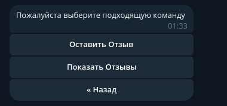

# Telegram Bot для приема заказов на фрилансе

## Функционал:

### Пользователь:
1. Реферальная Система
2. Цены (в разработке)
3. О нас
4. Правила (в разработке)
5. Техническая Поддержка
6. Создать Заказ
7. Просмотр Заказов
8. Промокоды (в разработке)
9. Отзывы (в разработке)
10. Наши Работы (в разработке)
11. О команде (в разработке)
12. Наш Сайт

### Админка: (в разработке)

## Фотографии

### Главное меню:


### Профиль:


### Профиль - Создать Заказ:


### Профиль - Описание Приложения:


### Профиль - Техническое Задание:


### Профиль - Техническое Задание - Приложить:


### Профиль - Техническое Задание - Заказ Создан:


### Профиль - Мои Заказы:


### Профиль - Мои Заказы - Информация о Заказе:


### Профиль - Мои Заказы - Информация о Заказе - Скачать ТЗ:


### Профиль - Реферальная Система


### Профиль - Реферальная Система - История начислений


### Ищем партнерова:


### Техническая Поддержка:


### О нас:


### О нас - Отзывы



## Инструкция по запуску

### 1. Поставить в .env (BOT_TOKEN) свой token
### 2. Запуск
```shell
sudo docker compose up --build
```
