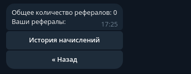

# Telegram Bot для приема заказов на фрилансе

## Функционал:

### Пользователь:
1. Реферальная Система
2. Цены (в разработке)
3. О нас
4. Правила (в разработке)
5. Техническая Поддержка
6. Создать Заказ
7. Просмотр Заказов
8. Промокоды
9. Отзывы
10. Наши Работы (в разработке)
11. О команде (в разработке)
12. Наш Сайт

### Админка:
1. Заказы
2. Промокоды
3. Пользователи (в разработке)
4. Отзывы
5. Настройка (в разработке)

## Фотографии

## Пользователь

### Главное меню:


### Профиль:


### Профиль - Создать Заказ:


### Профиль - Описание Приложения:


### Профиль - Техническое Задание:


### Профиль - Техническое Задание - Приложить:


### Профиль - Техническое Задание - Заказ Создан:


### Профиль - Мои Заказы:


### Профиль - Мои Заказы - Информация о Заказе:


### Профиль - Мои Заказы - Информация о Заказе - Скачать ТЗ:


### Профиль - Реферальная Система


### Профиль - Реферальная Система - История начислений


### Ищем партнерова:


### Техническая Поддержка:


### О нас:


### О нас - Отзывы


### О нас - Отзывы - Оставить Отзыв -- Сообщение


### О нас - Отзывы - Оставить Отзыв -- Рейтинг


### О нас - Отзывы - Оставить Отзыв -- Успех


### О нас - Отзывы - Показать Отзывы


### О нас - Отзывы - Показать Отзывы - Отзыв


## Администратор
### Главное меню:


### Заказы:


### Заказы - (Новые Заказы, На Согласовании, В работе, На Тестировании, Завершенные):


### Заказы - Заказ


### Заказы - Заказ - Показать Заказчика


### Заказы - Заказ - Изменить Статус


### Промокоды


### Промокоды - Создать промокод


### Отзывы


### Отзывы - Показать Отзывы


### Отзывы - Показать Отзывы - Отзыв


## Инструкция по запуску

### 1. Поставить в .env (BOT_TOKEN) свой token
### 2. Запуск
```shell
sudo docker compose up --build
```
